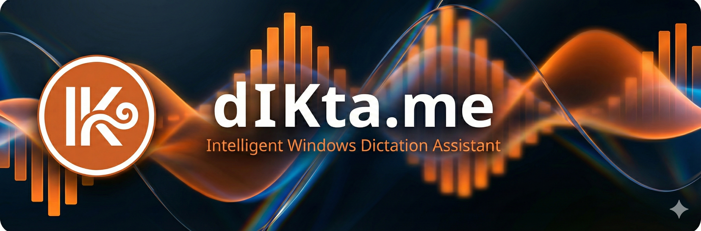
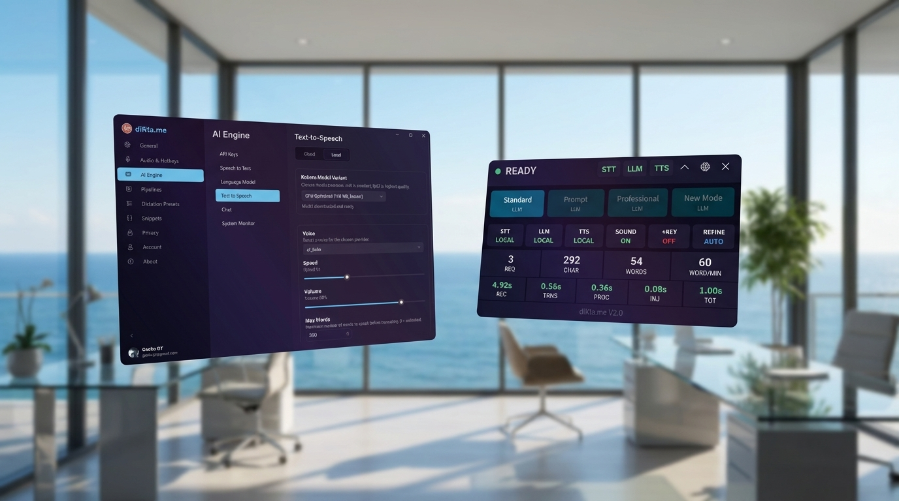

> **Language / Idioma:** English | [Español](README.es.md)

# 

# dIKta.me V2

[](https://github.com/geckogtmx/diktame/actions/workflows/ci-v2.yml)
[](LICENSE)
[](https://dotnet.microsoft.com/)
[](#metrics)

**Private AI voice dictation for Windows** — local-first, multi-provider, MIT open source.

> Stop typing at your AI models. Just talk to them.



## Quick Start

**Download the installer** from [GitHub Releases](https://github.com/geckogtmx/diktame/releases) (~47 MB) or build from source:

> 🛡️ **Security Note:** Official binaries are securely code-signed via the [SignPath Foundation](https://signpath.org/) specifically for open-source projects.

```bash
git clone https://github.com/geckogtmx/diktame.git
cd diktame
dotnet build DiktaMe.sln -c Release
dotnet run --project src/DiktaMe.App/DiktaMe.App.csproj
```

**First run:** The wizard walks you through choosing cloud (free trial) or local (Full Version) providers.

## Tech Stack

| Layer | Cloud | Local |
|-------|-------|-------|
| **STT** | Deepgram Nova-3, Gemini Audio | Whisper.net ONNX (GPU/CPU) |
| **LLM** | Gemini, OpenAI, Anthropic, OpenRouter | Ollama (any model) |
| **TTS** | Deepgram, OpenAI, Inworld, Gemini | Kokoro ONNX (~88 MB) |
| **Vision** | Gemini multimodal | minicpm-v via Ollama |

| Component | Technology |
|-----------|-----------|
| **UI** | WinUI 3 (Fluent Design), 3 themes |
| **Logic** | C# / .NET 8 |
| **Data** | SQLite (history, wallet, metrics) |
| **Security** | DPAPI encryption, PII scrubber |
| **Installer** | Inno Setup, self-contained x64, ~47 MB |

## Workflow Modes

| # | Mode | Hotkey | Description |
|---|------|--------|-------------|
| 1 | **Dictate** | `Ctrl+Alt+D` | Voice to text, injected at cursor |
| 2 | **Refine** | `Ctrl+Alt+R` | Select text, AI improves in-place |
| 3 | **Ask** | `Ctrl+Alt+A` | Voice Q&A, answer at cursor |
| 4 | **Translate** | `Ctrl+Alt+T` | EN/ES bidirectional |
| 5 | **Oops** | `Ctrl+Alt+V` | Re-inject last output |
| 6 | **Note** | `Ctrl+Alt+N` | Voice memos to markdown |
| 7 | **Read Selection** | `Ctrl+Alt+Q` | Text-to-speech playback |
| 8 | **Quick Chat** | `Ctrl+Alt+C` | Floating LLM chat overlay |

Plus: Vision/OCR (`Ctrl+Alt+S`), 16 custom prompt slots, voice snippets, audio ducking.

## Pricing

| Tier | Price | What You Get |
|------|-------|-------------|
| **Free Trial** | $0 | Cloud STT + LLM with cloud credits included. |
| **Full Version** | $20 (one-time) | Unlocks local Whisper + Ollama + Kokoro TTS + BYOK API keys. |
| **Build from Source** | $0 | MIT licensed. Clone, build, run. No license needed. |

## Solution Structure

```
DiktaMe.sln
+-- src/
|   +-- DiktaMe.App/          # WinUI 3 application (UI layer)
|   +-- DiktaMe.Core/         # Business logic (class library)
|       +-- Audio/             # NAudio recording, device management
|       +-- STT/               # Speech-to-Text providers
|       +-- TTS/               # Text-to-Speech providers
|       +-- LLM/               # LLM providers
|       +-- Pipeline/          # Workflow orchestration
|       +-- Input/             # Hotkeys, text injection
|       +-- Config/            # Settings, profiles, snippets
|       +-- Data/              # SQLite history, metrics
|       +-- Security/          # DPAPI secrets, PII scrubber, license
|       +-- Account/           # OAuth, wallet, token refresh
+-- tests/
|   +-- DiktaMe.Core.Tests/   # xUnit + Moq + FluentAssertions
+-- installer/                 # Inno Setup script + build script
+-- website/                   # Next.js marketing site (dikta.me)
```

## Development

### Prerequisites

- .NET 8 SDK
- Windows 10 (1809+) or Windows 11
- Optional: Inno Setup 6 (for building the installer)

### Build & Test

```bash
dotnet build DiktaMe.sln -c Release    # 0 warnings, 0 errors
dotnet test DiktaMe.sln                 # 1134 tests
```

### Publish & Install

```bash
# Build self-contained installer
cd installer
build-installer.cmd
# Output: installer/output/dIKta.me-2.0.0-Setup.exe
```

### Git Conventions

- **Trunk-based** development (commits directly to `main`)
- **Conventional Commits**: `feat(scope): description [TASK_ID]`

## Metrics

- **Build:** 0 errors, 0 warnings (`TreatWarningsAsErrors=true` + Meziantou.Analyzer)
- **Tests:** 1,134 passing (xUnit + Moq + FluentAssertions)
- **Installer:** ~47 MB (LZMA2 compressed, bilingual EN+ES)
- **CI/CD:** 14-step GitHub Actions pipeline (lint, build, test, secret scan, vulnerability audit, publish, installer)
- **Code Quality:** Meziantou.Analyzer, NuGetAudit, gitleaks, Coverlet coverage

## What's Next

- **Connectors Plugin:** Voice to Obsidian, webhooks, Discord
- **Meeting Intelligence:** Local-first meeting notes & synthesis
- **Memory Layer:** Semantic recall that improves with use
- **Refinemmarly:** Grammar checking via your own LLM

See [CHANGELOG.md](CHANGELOG.md) for the full V2.0 feature list.

---

## Built by

[Eduardo Garcia-Torres](https://www.linkedin.com/in/eduardogarciatorres/) — marketing & business executive from Mexico with 20+ years in IT consulting, digital media, and project management. Not a software engineer by training. dIKta.me is his first desktop application, built from scratch with C#, WinUI 3, and AI coding tools. The product decisions come from two decades of building businesses and shipping products — not a CS degree. [Full story](CONTRIBUTING.md#about-the-builder).

## License

[MIT](LICENSE) — use it, fork it, build on it.
