# Audio Architecture & Capture

The `DiktaMe.Core/Audio/` namespace controls the heartbeat of the dictation pipeline. It exclusively manages microphone devices, raw buffer capture, Memory Streams, and the automated ducking of competing desktop sounds.

dIKta.me relies internally on **NAudio** to securely interface with the low-level Windows WASAPI (Windows Audio Session API) driver ecosystem. 

## Audio Capture Lifecycle

```mermaid
sequenceDiagram
    participant User as User
    participant Hotkey as GlobalHotkeyService
    participant Audio as AudioCaptureService
    participant Ducker as AudioDuckerService
    participant STT as STTRouter (Pipeline)

    User->>Hotkey: Presses Ctrl+Alt+D
    Hotkey->>Audio: StartRecordingAsync()
    Audio->>Ducker: DuckDesktopAudio(20%)
    
    rect rgb(20, 40, 60)
        Note right of Audio: WASAPI Loop (16kHz 16-bit PCM)
        loop Every 300ms
            Audio-->>Audio: Write bytes to MemoryStream
            opt If IStreamingSTTProvider
                Audio->>STT: Yield return byte[] (WebSockets)
            end
        end
    end
    
    User->>Hotkey: Releases Ctrl+Alt+D
    Hotkey->>Audio: StopRecordingAsync()
    Audio->>Ducker: RestoreAudioVolume()
    
    opt If ISTTProvider (Batch)
        Audio->>STT: Submit monolithic byte[] array
    end
```

The interaction between the user pressing `Ctrl+Alt+D` (Dictate) and the raw voice audio being submitted to the Speech-to-Text inference engine involves a strict, memory-safe data lifecycle.

Because audio capture generates massive arrays of floating-point data, the architecture prioritizes minimizing object allocations.

### 1. Device Selection & Initialization
When the `AudioCaptureService` initializes, it queries the internal Windows mixer driver using NAudio's `MMDeviceEnumerator`. 
It will default to the primary system recording device unless the user has explicitly defined a unique microphone override string in the `.json` application settings.

### 2. Stream Buffering
Instead of holding an entire 10-minute WAV file in RAM identically, capture runs inside an asynchronous stream handler hooked into NAudio's `DataAvailable` event loop.

Audio is fundamentally sampled at **16 kHz, 16-bit Mono (PCM)**. This exact footprint is chosen intentionally because it is natively supported directly by Deepgram Flux/Nova, Whisper.net Local execution, and Google Gemini without requiring CPU-intensive upsampling or format conversion logic mid-flight.

### 3. Ducking (Audio Attenuation)
If the user has Audio Ducking enabled, the `AudioDuckerService` is immediately triggered on record start. 

The service drops into the Windows `AudioSessionManager` to find any process outputting audio (Spotify, Edge, Games) that *isn't* the core dIKta.me process. It sets the session volume scalar to the configured interface percentage (e.g. 20%) and then strictly waits to restore the volume exactly after the key is released.

### 4. Memory Stream Handoff
As the `WasapiCapture` feeds chunks of audio byte arrays, the `AudioCaptureService` writes them securely into an expanding, encapsulated `MemoryStream`. 

If the current Pipeline supports **Batch Processing** (like Whisper.net), this `MemoryStream` simply closes on key release and acts as the payload.

If the pipeline supports **Streaming Processing** (like Deepgram WebSockets), the capture loop actively intercepts each 320ms buffer packet and yields it directly onto the network socket asynchronously immediately, drastically cutting down total end-to-end user latency.
