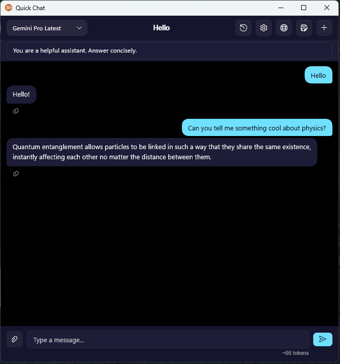

# Quick Chat

While dIKta.me is built around injecting text into your active applications, sometimes you just need to have a quick conversation with your AI assistant without typing into a document. 

This is where the **Quick Chat** overlay comes in. It behaves like a standard LLM chat interface (like ChatGPT or Claude) that you can summon anywhere, at any time.

## Accessing Quick Chat

To open the Quick Chat window, press the global hotkey:

`Ctrl + Alt + C` (Default)

This will open an overlay window that stays on top of your work. The Chat window allows for multi-turn conversations, meaning it remembers the context of your previous messages during that session.

## Voice or Text Input

You can interact with Quick Chat in two ways:
1. **Typing**: Simply type your question into the input box at the bottom and press Enter.
2. **Speaking**: Press the Microphone button to dictate your question. 

> [!NOTE]
> Unlike the main Dictation pipeline, voice input in Quick Chat uses **Raw STT**. This means your spoken question is transcribed directly without an initial layer of LLM formatting, ensuring your request is sent to the Chat Assistant exactly as you said it without any delay.

## Clipboard Context Attachments

One of Quick Chat's most powerful features is **Clipboard Attachments**.

If you have a block of code, a long email, or a chunk of text that you want the AI to analyze, simply copy it to your clipboard (`Ctrl + C`) and click the **Attach Clipboard** button in the Quick Chat input area.

When you send your next message, the contents of your clipboard are silently prepended to your prompt. 

*Example workflow:*
1. Highlight a confusing error message in your terminal and press `Ctrl+C`.
2. Press `Ctrl+Alt+C` to open Quick Chat.
3. Click "Attach Clipboard".
4. Type or say: *"What does this error mean?"*
5. The Assistant reads your clipboard and answers.

## Selecting Models and System Prompts

Unlike standard dictation modes that are tied strictly to your Control Panel profiles, the Quick Chat window allows you to change its behavior dynamically.

At the top of the Quick Chat window, you can:
*   **Select a Model**: Choose any available LLM from your configured Account or API Keys (e.g., GPT-4o, Claude 3.5 Sonnet, a local Ollama model).
*   **Toggle System Prompt**: Expand the top section to modify the System Prompt for the current conversation (e.g., change it from "You are a helpful assistant" to "You are a Senior C# Developer").
*   **Toggle Web Search**: If you are using a Gemini model, you can enable Google Search Grounding to allow the model to search the web for up-to-date answers.

## Conversation History

dIKta.me automatically manages your conversation history.
*   **Auto-Titling**: After your second message in a new chat, dIKta.me will use a small AI background task to automatically generate a 3-5 word title for the conversation.
*   **Context Truncation**: If a conversation goes on for a long time, Quick Chat automatically drops the oldest messages to ensure you don't exceed the model's token limits.
*   **Persistence**: All chats are saved locally on your machine. You can click the History button to reload, review, or delete past conversations.
