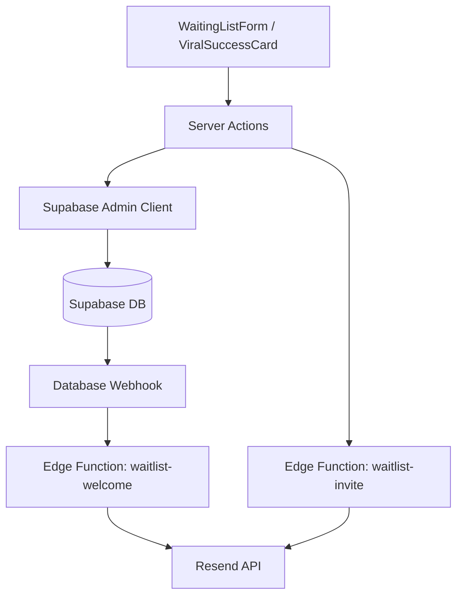

# dIKta.me Waitlist & Viral Invitation System

This document outlines the technical implementation of the waitlist and priority pass (invitation) system for dIKta.me V2.

## Architecture Overview

The system follows a "Pipeline" orchestration pattern using Next.js Server Actions, Supabase, and Resend.

## 1. Database Schema

Managed via Supabase migrations in `website/supabase/migrations/`:

### `waiting_list` (`003_waiting_list.sql`, `005_unique_waitlist_email.sql`)
- `id`: UUID (Primary Key)
- `name`: TEXT
- `email`: TEXT (UNIQUE)
- `created_at`: TIMESTAMP

### `waitlist_invites` (`006_waitlist_invites.sql`)
- `id`: UUID (Primary Key)
- `sender_id`: UUID (FK to `waiting_list.id`)
- `recipient_email`: TEXT
- `invited_at`: TIMESTAMP
- *Constraint*: `unique_invite_per_sender` (sender_id, recipient_email)

## 2. Server Actions (`website/app/actions/waitlist.ts`)

These actions use `createAdminClient` to bypass Row-Level Security (RLS) for server-side management.

- **`submitWaitlist`**: 
    - Handles inserts into `waiting_list`.
    - Catches Postgres error `23505` (Unique Violation).
    - On duplicate signup, it fetches the existing record and returns it to the client to restore the invitation state.
- **`sendWaitlistInvite`**:
    - Verifies the 5-invite limit per `sender_id`.
    - Inserts record into `waitlist_invites`.
    - Triggers the `waitlist-invite` Edge Function via a `POST` request.
- **`getWaitlistInvites`**:
    - Retrieves a list of previously invited emails to ensure the UI persists the "slots" across sessions/duplicate signups.

## 3. Edge Functions (`website/supabase/functions/`)

### `waitlist-welcome`
- **Trigger**: `INSERT` on `waiting_list` (via Supabase Webhook).
- **Purpose**: Sends a branded "Thank You" email to the user.
- **Fallback**: Uses `onboarding@resend.dev` as the sender if the custom domain is not yet verified in Resend.

### `waitlist-invite`
- **Trigger**: Direct HTTP call from `sendWaitlistInvite` server action.
- **Purpose**: Sends a personalized email: `[Sender] gifted you a Priority Pass`.

## 4. Required Configuration (Secrets & Hooks)

### Supabase Secrets
The following secrets must be set in the Supabase Dashboard (`Settings > Edge Functions > Secrets`):
- `RESEND_API_KEY`: Found in your Resend Dashboard.

### Database Webhook
The SQL-based `pg_net` trigger can sometimes be unreliable depending on environment extensions. It is recommended to create the "welcome" bridge manually:
- **Table**: `waiting_list`
- **Event**: `INSERT`
- **Hook Type**: `HTTP Request (POST)`
- **URL**: `https://[project-id].supabase.co/functions/v1/waitlist-welcome`
- **Headers**: `Authorization: Bearer [anon_key]`

## 5. Testing & Verification

### A. The "Self-Invite" Confirmation
Resend's "Test Mode" (unverified domain) only allows sending emails to the **account owner**.
1. Sign up for the waitlist.
2. Enter your **own email address** (the one associated with your Resend account) in one of the 5 invitation slots.
3. If the "Priority Pass" email arrives, the entire API pipeline (Admin Client -> Edge Function -> Resend) is confirmed.

### B. Duplicate Detection
1. Sign up with `test@example.com`.
2. Send 2 invites.
3. Reload the page and sign up again with `test@example.com`.
4. **Expected Result**: The UI should show "Success: You're already on the list" and immediately display the 2 slots you already filled (3 remaining).

### C. Logging
Monitor the following logs for errors:
- **Vercel Logs**: For Server Action failures.
- **Supabase Edge Function Logs**: For Resend API errors (e.g., `403 Forbidden` if the domain is unverified).
- **Supabase Webhook Logs**: To verify the database is successfully calling the welcome function.
