# Arquitectura de Audio y Captura

El espacio de nombres `DiktaMe.Core/Audio/` controla el corazón de la canalización de dictado. Administra exclusivamente los dispositivos de micrófono, la captura de búferes crudos, los flujos en memoria (Memory Streams) y la atenuación (ducking) automatizada de sonidos del escritorio que compiten en el equipo.

dIKta.me confía internamente en **NAudio** para interactuar de manera segura con el ecosistema de controladores WASAPI (Windows Audio Session API) de bajo nivel de Windows.

## Ciclo de Vida de la Captura de Audio

```mermaid
sequenceDiagram
    participant User as Usuario
    participant Hotkey as GlobalHotkeyService
    participant Audio as AudioCaptureService
    participant Ducker as AudioDuckerService
    participant STT as STTRouter (Pipeline)

    User->>Hotkey: Presiona Ctrl+Alt+D
    Hotkey->>Audio: StartRecordingAsync()
    Audio->>Ducker: DuckDesktopAudio(20%)
    
    rect rgb(20, 40, 60)
        Note right of Audio: Bucle WASAPI (16kHz PCM 16-bit)
        loop Cada 300ms
            Audio-->>Audio: Escribir bytes a MemoryStream
            opt Si IStreamingSTTProvider
                Audio->>STT: Retornar byte[] (WebSockets)
            end
        end
    end
    
    User->>Hotkey: Suelta Ctrl+Alt+D
    Hotkey->>Audio: StopRecordingAsync()
    Audio->>Ducker: RestoreAudioVolume()
    
    opt Si ISTTProvider (En lote)
        Audio->>STT: Enviar array byte[] monolítico
    end
```

La interacción entre el usuario que presiona `Ctrl+Alt+D` (Dictar) y el audio de voz crudo que se envía al motor de inferencia de Voz a Texto involucra un ciclo de vida estricto y seguro en la memoria.

Debido a que la captura de audio genera matrices masivas de datos de punto flotante, la arquitectura prioriza la minimización de asignaciones de objetos.

### 1. Selección del Dispositivo e Inicialización
Cuando el `AudioCaptureService` se inicia, consulta el controlador del mezclador interno de Windows utilizando el `MMDeviceEnumerator` de NAudio. 
Se establecerá por defecto al dispositivo de grabación del sistema primario, a menos que el usuario haya establecido explícitamente una anulación (override) única de su micrófono en los ajustes de la aplicación.

### 2. Búfer de Flujo (Stream Buffering)
En lugar de mantener todo un archivo WAV completo de 10 minutos de forma idéntica en la RAM, la captura se ejecuta dentro de un manejador de flujo asíncrono conectado al bucle `DataAvailable` de NAudio.

El audio es fundamentalmente muestreado a **16 kHz, PCM Mono de 16 bits**. Esta huella exacta se eligió de forma intencionada porque está soportada de forma totalmente nativa por Deepgram Flux/Nova, la ejecución local de Whisper.net, y Google Gemini, sin requerir remuestreo o conversiones de formato que demanden un alto uso de la CPU en pleno vuelo.

### 3. Atenuación (Audio Ducking)
Si el usuario tiene habilitada la atenuación de audio de escritorio (Audio Ducking), el `AudioDuckerService` se activará de inmediato al iniciar la grabación. 

El servicio ingresa al `AudioSessionManager` de Windows para encontrar cualquier proceso que esté enviando audio a la salida (como Spotify o navegadores) que *no* sea el proceso central de dIKta.me. Establece el volumen de sesión al porcentaje configurado (ej. 20%) y espera estrictamente para restaurar el volumen exactamente después de que se suelta la tecla.

### 4. Entrega de Secuencia de Memoria (Memory Stream Handoff)
A medida que el `WasapiCapture` suministra bloques de arreglos de bytes de audio, el `AudioCaptureService` los escribe de forma segura en un `MemoryStream` encapsulado y en expansión. 

Si la canalización actual admite **Procesamiento por Lotes (Batch Processing)** (como Whisper.net), este `MemoryStream` simplemente se cierra al soltar la tecla y actúa como la carga útil.

Si la canalización admite **Procesamiento por Transmisión (Streaming Processing)** (como Deepgram WebSockets), el bucle de captura intercepta activamente cada paquete de búfer de 320ms y lo envía directamente al socket de red de forma asincrónica e inmediata, reduciendo drásticamente la latencia total del usuario.
